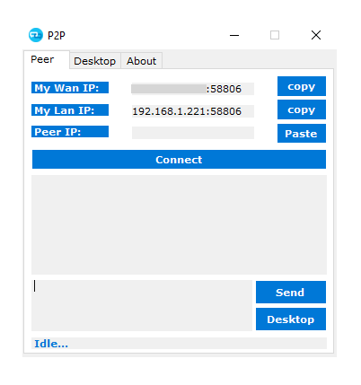
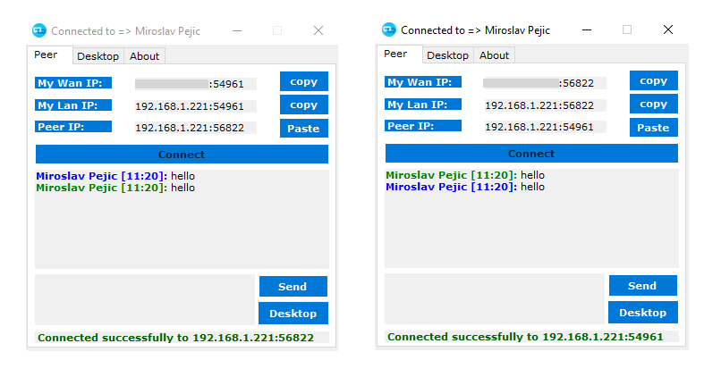

  

# 
LILO P2P

P2P based - Portable, No Configuration or Installation Needed.

## How it works

- Compile and Open `p2p.exe` as admin on the device you want to send data and on the one you want to recieve it.

- Copy the `My Lan or Wan IP` and communicate it to other peer and vice versa.

- The 2 peers have now the 2 endpoint to connect to, so press on both `Connect`.
- The 2 peers now are able to `sent messages` `transfer data` or take the `Remote Desktop Control` between them.

 

It's use [UDT protocol](https://en.wikipedia.org/wiki/UDP-based_Data_Transfer_Protocol)
and thanks to `rendezvous` connection, it should be able to `bypass most firewall rules`, like a small concept of `TeamViewer` at 0 cost!

 

## License

